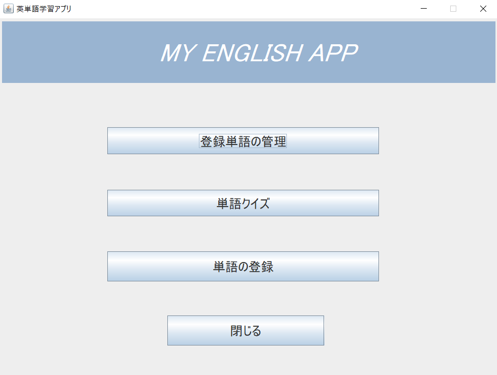
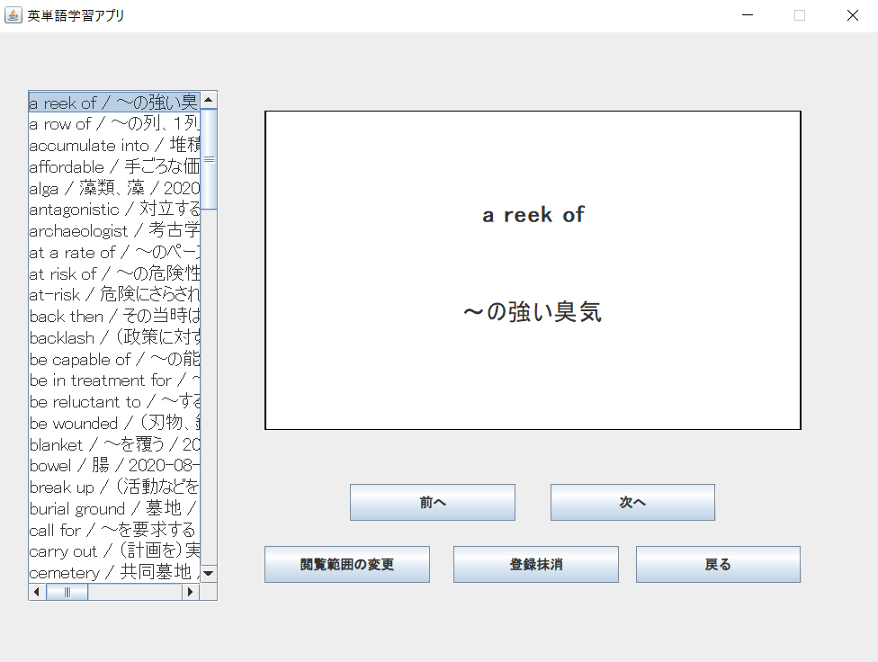
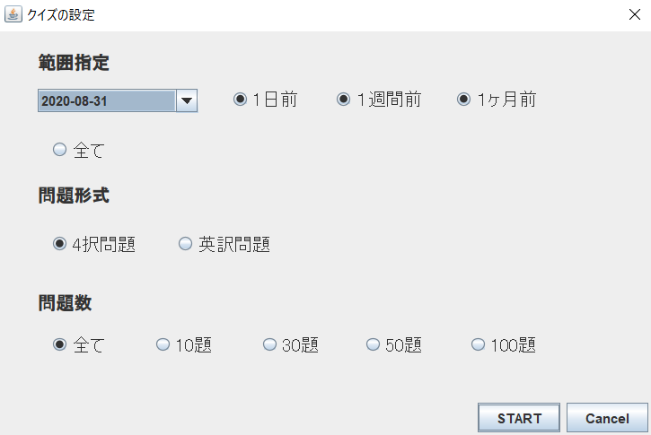
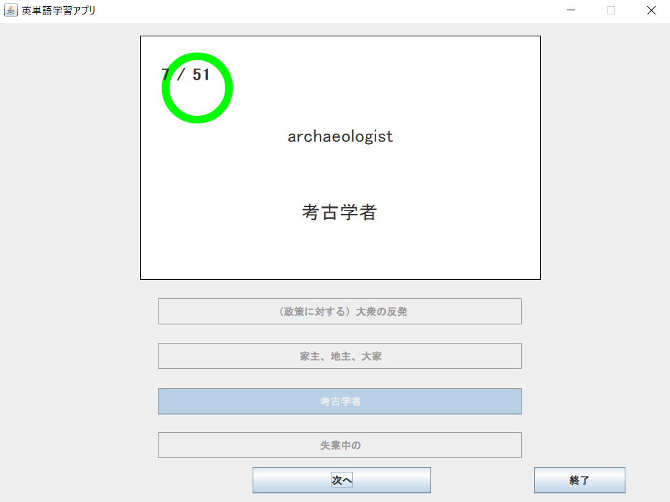
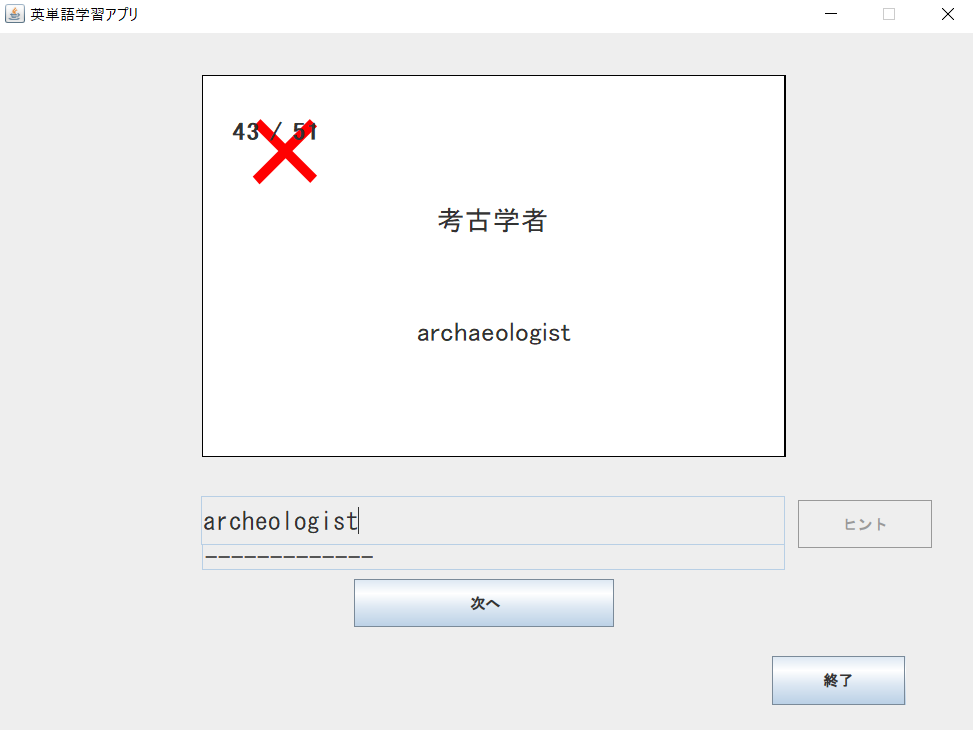
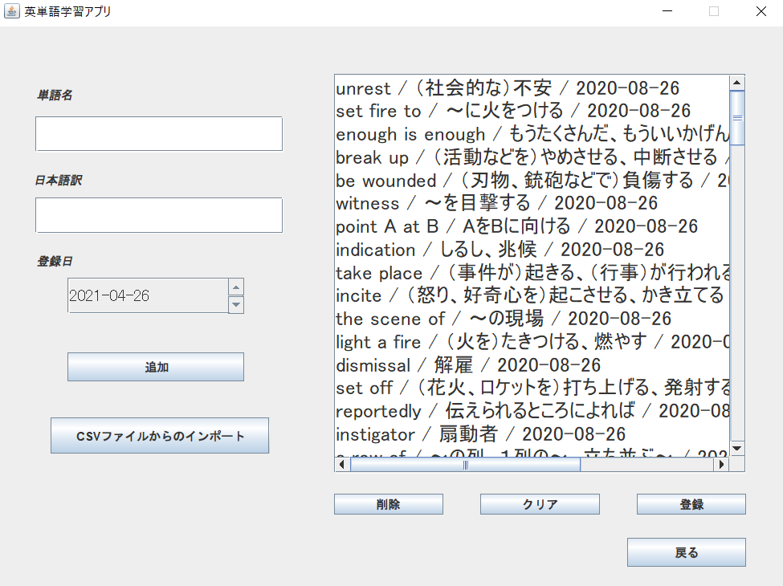

# 英単語学習アプリ
JavaのSwingとデータベースのPostgreSQLを使って、英単語学習アプリを作成しました。  
単語の登録、削除、閲覧、クイズ（４択問題、英訳問題）を行うことができます。  


## アプリを使用する前に
このアプリを動かすためには、[JDK](https://www.oracle.com/jp/java/technologies/javase-downloads.html)と[PostgreSQL](https://www.postgresql.org)のインストールが必要になります。  
これらのインストール後、アプリを使い始める前に必要な設定について説明します。

1.wordappプロジェクトをダウンロードして、適当な場所に配置します。

2.postgreSQLを起動して、wordappプロジェクト直下にある[setup.sql](setup.sql)ファイルを実行します。  
```
cd wordappプロジェクト直下のパス  
psql -U ユーザー名  
\i setup.sql  
```

3.[src/wordapp/dao/CardsDAO.java](src/wordapp/dao/CardsDAO.java)ファイル内のpostgresqlのユーザー名とパスワードを自分のものに書き換えます。
```
private final String user = "ユーザー名";
private final String password = "パスワード";
```
4.wordappプロジェクト直下にある[build.bat](build.bat)ファイルを実行します。
```
cd wordappプロジェクト直下のパス  
build 
```

5.wordappプロジェクト直下に作成されたwordapp.jarをクリックすれば、アプリを起動できます。  

## アプリのスナップショット
以下は、アプリ実行時のスナップショットです。  
 ホーム画面  

 

登録単語の管理画面



クイズの設定画面



４択問題画面



英訳問題画面



単語の登録画面


